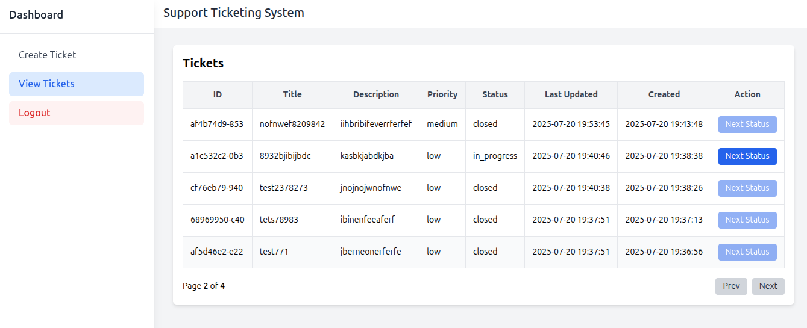
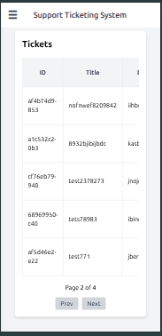
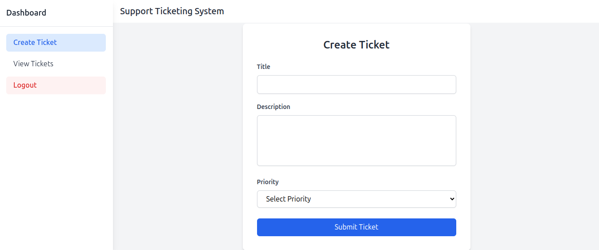
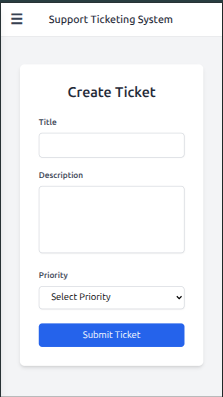

# 🎫 Ticketing System 
#### (React + Vite + Express + PostgreSQL)

A full-stack ticketing system built with:

- **Frontend**: React + Vite + Tailwind CSS  
- **UI Table**: TanStack Table (React Table)  
- **Backend**: Express.js (Node.js)  
- **Database**: PostgreSQL  
- **Deployment**: Docker, GitHub Actions, Nginx  

---

## 📸 Features

- View, create, update tickets
- Status change workflow for tickets
- Auth system mock
- Mobile-friendly layout with sidebar
- Powerful dynamic tables using **TanStack Table**
- Dockerized for production deployment

---

## 🛠️ Tech Stack

| Layer      | Stack                              |
|------------|------------------------------------|
| Frontend   | React, Vite, Tailwind CSS          |
| Table UI   | TanStack Table (v8)                |
| Backend    | Express.js, Node.js                |
| Database   | PostgreSQL                         |
| Deployment | Docker, Nginx, GitHub Actions      |

---

## 🏗️ Project Structure

```bash
root/
├── front-end/              
│   ├── src/
│   ├── index.html
│   └── vite.config.js
├── back-end/
│   ├── config/               
│   ├── controllers/
│   ├── routes/
│   ├── service/
│   ├── migrations/
│   ├── Utils/
│   ├── models/
│   └── app.js
├── docker-compose.yml
├── nginx/
│   └── default.conf
└── README.md
```

##  Setup Instructions

#### Clone the repository

```bash
    git clone https://github.com/yuthish-p/ticketing_app.git
    cd ticketing-app
    sudo docker-compose -f compose.yml up -d --build
    sudo docker ps
```
#### App runing
```bash
    fornt-end => http://localhost:4001
    back-end  => http://localhost/api:6001
```

#### Ticket Endpoints
```bash
GET  /api/ticket     -> Fetch all tickets
POST /api/ticket     -> Create new ticket
Post /api/ticket/:id -> Update Ticket status
```

## 📝 Notes

- **Authentication is mocked** — there is **no actual login/signup API** implemented yet.
- In future, JWT-based authentication can be added easily.
- For now, **any user can:**
  - Create new tickets
  - View all tickets
  - Update the status of any ticket
- Status updates are done via the **"Action"** dropdown in the ticket table UI.

---
##  Screenshots

####  Ticket List View




---

####  Create Ticket Form




## LIVE => https://app.yuthish.io
